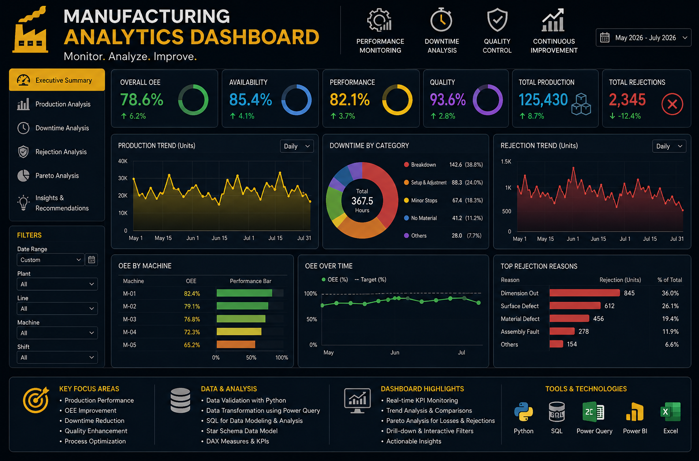
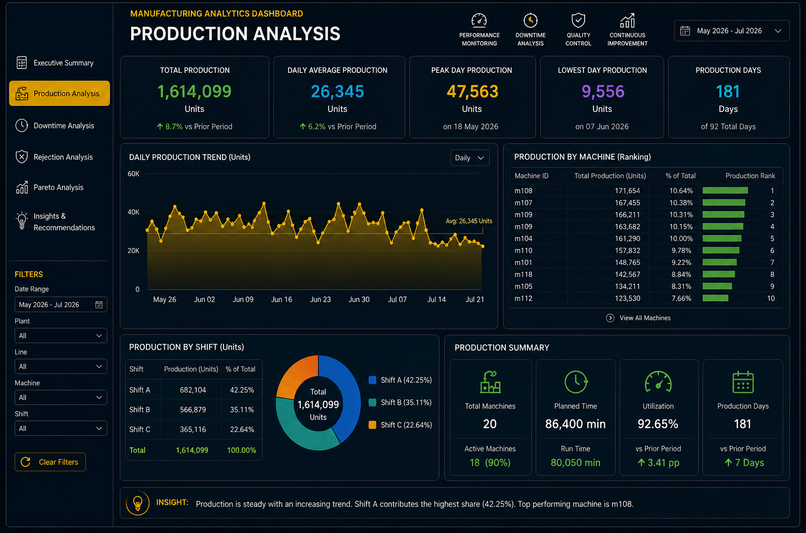
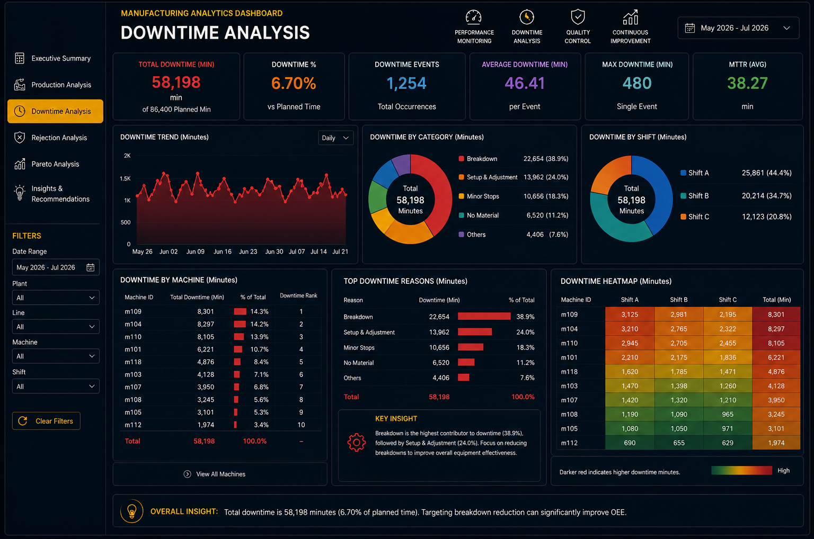
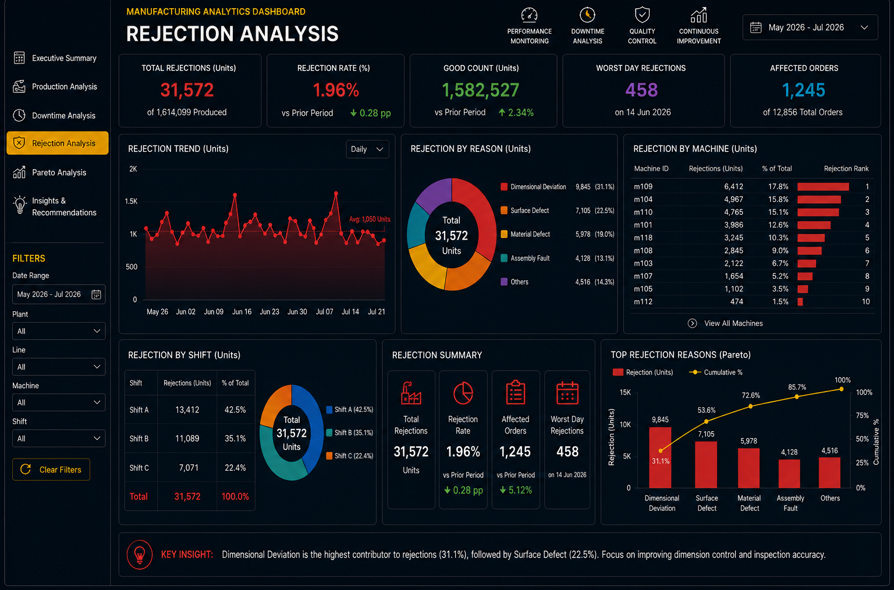
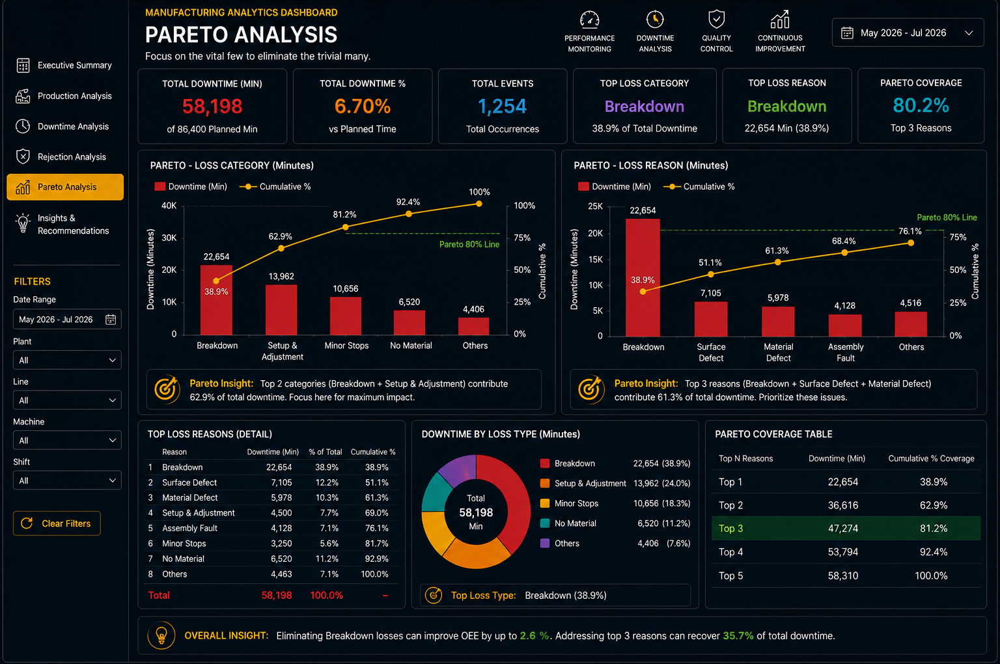
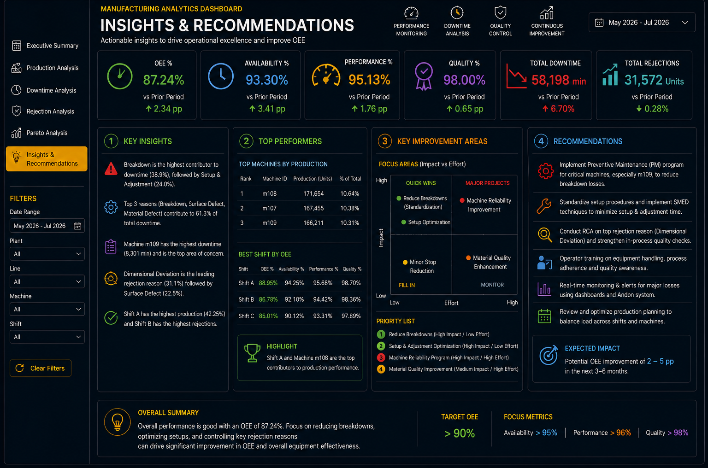

# Manufacturing Analytics Dashboard

> **Monitor. Analyze. Improve.**

A validation-first manufacturing analytics project focused on production performance, Overall Equipment Effectiveness (OEE), downtime, quality losses, root-cause analysis, and operational decision support.

The project combines **Python, SQL, Power BI, and structured analytical modelling** to convert manufacturing data into KPI-driven operational insights.

---

## 🎯 Project Objective

The objective is to build an interactive Manufacturing Analytics Dashboard for monitoring:

- Overall Equipment Effectiveness (OEE)
- Availability
- Performance
- Quality
- Production performance
- Machine performance
- Downtime and loss drivers
- Rejection and quality losses
- Root-cause trends
- Operational improvement opportunities

The analytical foundation has been developed first, with dashboard implementation treated as the next development stage.

---

## 🧭 Analytical Workflow

The project follows a **business-first, validation-first workflow**:

**Business Requirement → Data Understanding → Data Validation → Data Preparation → KPI Definition → SQL Analysis → Root-Cause Analysis → Dashboard Development → Business Insights**

### Validation First

Python (Pandas) is used before SQL analysis to validate the analytical datasets through:

- Duplicate detection
- Null-value validation
- Business-rule checks
- Negative / invalid quantity checks
- Machine master validation
- Cross-table consistency checks

Validated data is then used for SQL analysis and KPI development.

---

## 🏭 Core KPI Framework

The analytical model covers the core manufacturing performance metrics:

| KPI | Purpose |
|---|---|
| **OEE** | Overall equipment effectiveness |
| **Availability** | Equipment availability against planned time |
| **Performance** | Actual production performance against planned production |
| **Quality** | Good production relative to actual production |
| **Production** | Output and production trends |
| **Downtime** | Loss minutes and major downtime contributors |
| **Rejection %** | Quality-loss monitoring |
| **MTTR** | Mean Time to Repair |
| **MTBF** | Mean Time Between Failures |
| **Target vs Actual** | Production performance comparison |

The KPI definitions and calculations are documented as part of the analytical workflow.

---

## 📊 Analytical Areas

### 📈 Production Analysis

The production analysis focuses on:

- Daily production trends
- Production target vs actual
- Machine-wise production
- Shift-wise production
- Production ranking
- Running production trends

SQL analysis uses aggregations, CTE and window functions where appropriate to support ranking and trend analysis.

### ⏱️ Downtime Analysis

The downtime analysis focuses on:

- Total downtime
- Downtime by machine
- Downtime by loss category
- Downtime ranking
- Major loss contributors
- Operational loss trends

### 🛡️ Rejection Analysis

The quality analysis focuses on:

- Total rejection
- Rejection rate
- Rejection trends
- Rejection by machine
- Rejection by shift
- Rejection by reason
- Major quality-loss contributors

### 📊 Pareto Analysis

Pareto analysis is used to identify the **vital few contributors** behind operational losses and quality issues.

Planned analytical views include:

- Downtime reason Pareto
- Loss-category Pareto
- Machine breakdown Pareto
- Rejection-cause Pareto

### 💡 Insights & Recommendations

The final analytical layer converts KPI and root-cause findings into:

- Key operational insights
- Priority improvement areas
- Root-cause observations
- Recommended actions
- Management-level decision support

---

## 🖼️ Dashboard Design References

The following images are maintained as **dashboard design/reference artifacts** for the upcoming dashboard implementation.

They are intentionally kept without numeric prefixes so the filenames remain clean and presentation-friendly.

### 🎯 Executive Summary



### 📈 Production Analysis



### ⏱️ Downtime Analysis



### 🛡️ Rejection Analysis



### 📊 Pareto Analysis



### 💡 Insights & Recommendations



> **Note:** These artifacts represent the intended dashboard structure and analytical presentation. They are reference designs for the dashboard implementation stage and will be replaced or updated with the final dashboard outputs as development progresses.

---

## 🧱 Analytical Architecture

The project follows a structured analytical architecture designed for maintainability and future dashboard integration.

**Source Data → Python Validation → Clean Analytical Data → SQL Analysis → KPI Layer → Star Schema → Dashboard → Insights**

The analytical model is designed around a **star-schema approach** to support consistent KPI reporting and scalable analysis.

---

## 🛠️ Tools & Technologies

- **Python / Pandas** — ETL validation and data-quality checks
- **SQL / PostgreSQL** — KPI calculations, aggregation and analytical queries
- **Power BI** — Dashboard development and executive reporting
- **Excel / Power Query** — Supporting data preparation and validation
- **GitHub** — Version control and project documentation

---

## 📁 Repository Structure

```text
Manufacturing-Analytics-Dashboard/
│
├── Data/
│   ├── Production_Data/
│   ├── Loss_Data/
│   ├── Rejection_Data/
│   └── Machine_Master/
│
├── Screenshot/
│   ├── Executive_Summary.png
│   ├── Production_Analysis.png
│   ├── Downtime_Analysis.png
│   ├── Rejection_Analysis.png
│   ├── Pareto_Analysis.png
│   └── Insights_Recommendations.png
│
├── SQL/
│   └── Manufacturing_Analytics_Queries.sql
│
├── Python/
│   └── Validation/
│
└── README.md
```

---

## 📌 Current Status

**Current Stage:** Analytical development completed / dashboard implementation next.

The project has established:

- Data validation workflow
- Business-rule validation
- Manufacturing KPI definitions
- SQL analytical layer
- Production analysis
- Downtime analysis
- Quality and rejection analysis
- Pareto analysis
- Root-cause analytical framework
- Dashboard design references

The next development stage is to implement the validated analytical model in the final interactive dashboard while preserving the established KPI definitions, business logic, and analytical narrative.

---

## 👤 Author

**Rajat Choudhury**

Operations & Supply Chain Analytics | Manufacturing & Business Analytics

[GitHub Portfolio](https://github.com/RajatChoudhury-31)

---

## 📝 Note

This project is presented for **portfolio, learning, and professional demonstration purposes**.

The repository contains selected project evidence, analytical artifacts, representative data, SQL analysis, validation workflows, and dashboard design references. Private working files and implementation details may be excluded from the public repository.
